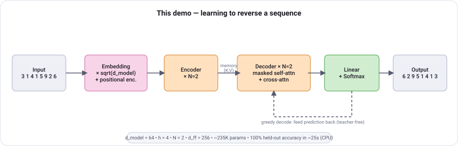
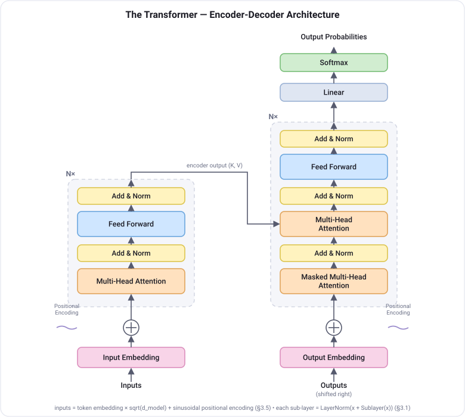
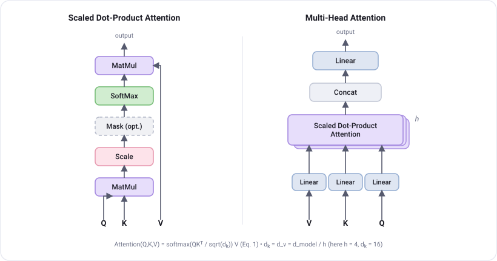

# Transformer Demo — *Attention Is All You Need*

A single-file, from-scratch implementation of the Transformer from
[Vaswani et al., 2017 — *Attention Is All You Need*](https://arxiv.org/abs/1706.03762),
trained on a toy sequence-reversal task so you can watch it learn.

<div align="center">
   embedding -> encoder -> decoder -> reversed output" width="880">
</div>

```bash
python3 transformer_demo.py
```

Trains an encoder–decoder Transformer to reverse a sequence of digits
(`3 1 4 1 5 → 5 1 4 1 3`), then greedy-decodes held-out examples.
On CPU it reaches **100% token accuracy in ~25 seconds**.

## Architecture

The full encoder–decoder stack (paper Figure 1). The encoder (left) is `N`
identical layers of self-attention + feed-forward; the decoder (right) adds a
masked self-attention sub-layer and an encoder–decoder cross-attention
sub-layer. Every sub-layer is wrapped as `LayerNorm(x + Sublayer(x))`.

<div align="center">
  
</div>

Attention itself (paper Figure 2): scaled dot-product attention on the left, and
multi-head attention — `h` attention layers running in parallel — on the right.

<div align="center">
  
</div>

## What's implemented from the paper

Only `nn.Linear` / `nn.Embedding` / `nn.LayerNorm` / `nn.Dropout` and the Adam
optimizer are borrowed — attention, multi-head, and positional encoding are all
written by hand. No `nn.Transformer` / `nn.MultiheadAttention`.

| Paper | Code |
|---|---|
| Scaled Dot-Product Attention, Eq. 1 — `softmax(QKᵀ/√dₖ)V` | `scaled_dot_product_attention` |
| Multi-Head Attention, §3.2.2 — split into *h* heads, concat, `Wᴼ` | `MultiHeadAttention` |
| Sinusoidal Positional Encoding, §3.5 | `PositionalEncoding` |
| Position-wise FFN, Eq. 2 — `max(0, xW₁+b₁)W₂+b₂`, `d_ff = 4·d_model` | `FeedForward` |
| Residual + LayerNorm sublayers, §3.1 | `EncoderLayer` / `DecoderLayer` |
| Causal-masked decoder self-attn + encoder–decoder cross-attn, §3.2.3 | `DecoderLayer`, `causal_mask` |
| `√d_model` embedding scaling, §3.4 | `Transformer._emb` |

The script also prints a one-time tensor-shape trace of the forward pass and an
ASCII heatmap of the decoder's cross-attention — which comes out as a clean
anti-diagonal, since reversal means output position *t* attends to source
position *(n−t)*:

```
Decoder cross-attention (last layer, head 0) -- output attends to source:
         9  2  0  4  6  1  3  0   <- source (input)
  out  0                    .  @
  out  3                    *  =
  out  1              :  :  =  -
  out  6           :  *  .
  out  4        .  %  :
  out  0     .  %  .
  out  2  :  #  .
  out  9  +  +
```

## Config

`N=2` layers, `d_model=64`, `h=4` heads, `d_ff=256` — ~235K parameters, small
enough to train quickly on CPU.

## Requirements

- Python 3
- `torch`
- `numpy`

## Diagrams

The SVGs in `docs/` are generated by a small script (no external assets):

```bash
python3 docs/make_diagrams.py
```

## License

The paper itself is not included here; see the
[arXiv page](https://arxiv.org/abs/1706.03762). This demo code is provided as-is
for educational use.
